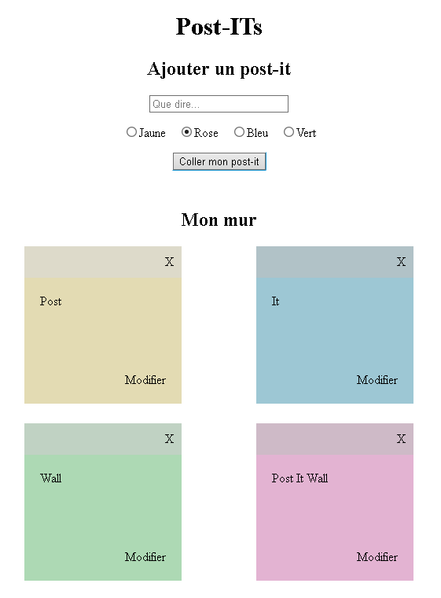

# Documentation de déploiement


## 📝 Description
Post-ITs est une application web qui permet d’ajouter, modifier et supprimer des **post-its virtuels** sur un mur numérique.
Chaque post-it peut être **personnalisé** par sa couleur et son contenu, offrant une manière simple et visuelle d’**organiser** ses idées.



## 🛠️ Fonctionnalités principales
- **Ajouter un post-it** : saisir un texte et choisir une couleur (jaune, rose, bleu ou vert).
- **Affichage sur le mur** : les post-its apparaissent sur un mur central, chacun avec sa couleur choisie.
- **Supprimer un post-it** : cliquer sur le bouton X pour retirer un post-it du mur.
- **Modifier un post-it** : cliquer sur Modifier pour changer le contenu déjà collé.
- **Interface simple et intuitive** : champs de saisie, choix de couleur via boutons radio, et rendu visuel immédiat.

## 📊 Infrastructures techniques
- BDD : MongoDB

## 📂 Structure du projet 
### Back-end
```bash
/back
    /controllers
    /models
    /routes
    .env.example
    .gitignore
    app.js
    db.js
    README.md

```

### Front-end
```bash
/front
    /src
        /assets
        /components
        /pages
        App.jsx
        main.jsx
        style.css
    .gitignore
    index.html
    README.md
```

## ⚙️ Installation locale 
> TOUTES LES COMMANDES SONT À INSERER À LA RACINE DU PROJET

### Prérequis
- Node.js v18+ et npm v9+
- MongoDB 6
- Variables d'environnement : `PORT`, `DB_URI`


### 1. Cloner le projet 
```bash
git clone https://github.com/elise-kinn/post-it-wall
```


### 2. Installer les dépendances 

```bash
cd back && npm install
```
```bash
cd front && npm install
```

### 3. Configuration des variables d'environnement 

Créer un fichier `.env` dans `/back`
```bash
PORT=<ton_port>
DB_URI=<Lien_vers_ta_base_MongoDB_Atlas>
```

### 4. Lancer le front-end
```bash
cd front
npm run dev
```
L'application est disponible sur http://localhost:5173.

### 4. Lancer le back-end
```bash
cd back
nodemon ./app.js
```
Lancez le serveur sur http://localhost:3000.

## 🚀 Procédures de déploiement

### Back-end : Render
1. Aller sur Render (https://render.com) et créer un nouvel app Web Service.
2. Connecter le dépôt GitHub
3. Renseigner les champs :  
- Root Directory : `back/`
- Build Command : 
``` bash
npm install
```

- Start Command :

``` bash
node ./app.js
```

4. Dans l’onglet Environment Variables, ajouter :
``` bash
PORT=3000
DB_URI=<Lien_vers_ta_base_MongoDB_Atlas>
```
5. Lancer le déploiement

### Front-end : Netlify
1. Aller sur Netlify (https://www.netlify.com) et créer un nouveau site depuis Git.
2. Choisir ton dépôt GitHub.
3. Configurer les options de build :
- Branch to deploy: `main`
- Base directory : `front`
- Build command :
```bash
npm run build
```
- Publish directory :
```bash
front/dist
```
4. Lancer le déploiement
5. Rendez-vous sur l'URL qui vous avez renseigné (exemple : https://post-it-wall.netlify.app)